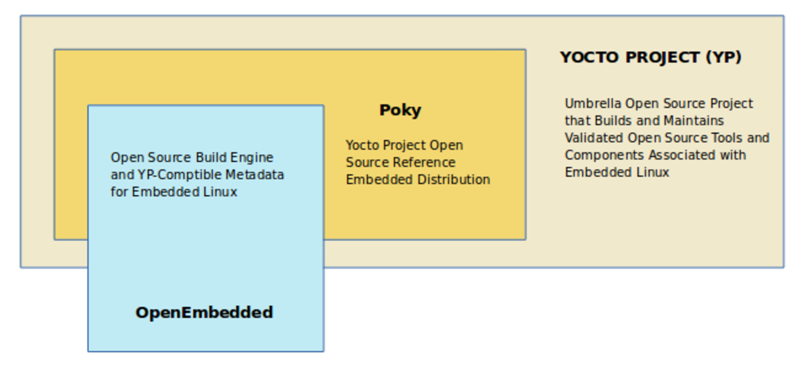

# Lain's NAVI
---

<!-- end_slide -->
# whoami
---


Anne / Anya / Anne

Head of gambiarra

Cat girl hacker

[https://github.com/retpolanne](https://github.com/retpolanne)

[https://blog.retpolanne.com](https://blog.retpolanne.com)
<!-- end_slide -->
# O que vem por aí
---

- Serial Experiments Anne - o incrível mundo do UART

- Lain no VHS

- The PHYnal Countdown

- Miscelânea
<!-- end_slide -->
# Serial Experiments Anne - o incrível mundo do UART

- Vamos falar sobre como conversar com dispositivos usando portas serial

- TTL (Transistor-Transistor Logic), UART (universal asynchronous receiver-transmitter) e RS232 (Recommended Standard 232)
---

<!-- end_slide -->
# Baud Rate, UART, TTL e RS232
---
- baud /bɔːd/ é a medida de pulsos por segundo ou sinais que um equipamento transmite
- quando conseguimos dar match entre o baud rate de dois dispositivos, eles podem conversar entre si!
- o mais comum é utilizarmos sinais TTL (0v == 0, 5v == 1), e existem dispositivos que interpretam esses sinais em série (como bits, e aí ASCII)
- UART é um circuito que faz transmissão (Tx) e recepção (Rx) de sinais 


<!-- end_slide -->
# Curious Annie finds an opportunity to hack 🤔
---
- Eu costumo usar o Linux headless, via SSH
- Porém, não sei quando o sistema operacional está up ou se houve uma falha durante o boot
- Por que não ler o console serial do Linux via UART? 
<!-- end_slide -->

# Olhando pra placa mãe
---
Normalmente, placas com UART possuem três pinos: Rx, Tx e GND.

Porém, placas mãe possuem um header COM. 


Aparentemente, NSIN == Rx, NSOUT == Tx, e temos um GND também.
<!-- end_slide -->

Porém, quando tentei ligar tudo num FTDI, garbage!


<!-- end_slide -->
# Annie ur breaking the board!!!!
---
Aparemente, placas mãe operam em RS232 (-12V, +12V), e não TTL (0v, 5v)! Eu poderia ter fritado tudo! 

Mas! Eu não sabia de um detalhe muito importante...


*Já explico isso aqui :P*
<!-- end_slide -->
Tentativa de reduzir a voltagem - com ajuda de meu amigo (e ex namorado) Kawai, nós reduzimos a voltagem com um monte de resistores.


Não deu bom :c
<!-- end_slide -->

Depois de um dia inteiro rebootando o computador (e bloqueando meu TPM...), eu decidi usar um Logic Analyzer


Nada fazia sentido :c
Até que corrigi o baud rate e inverti os bits:


DEU BOM! Os bits estavam invertidos.
<!-- end_slide -->

Conversando com um pessoal do grupo de Hardware Hacking, eu descobri que o sinal de RS232 é diferente do TTL! 


TOUT - vermelho - sinal RS232 (-12V ~ +12V)

TIN e ROUT - bege e preto - sinal TTL (0v ~ 5v)

Eu precisava de algo para converter RS232 em TTL e vice-versa

<!-- end_slide -->
Behold: MAX232!


<!-- end_slide -->


<!-- end_slide -->


<!-- end_slide -->


<!-- end_slide -->
# Serial Experiments Lain em VHS usando Raspberry Pi, Yocto e GStreamer

- Vamos ver sobre Yocto e Gstreamer

- Let's all love Lain

<!-- end_slide -->
# Let's all love Lain
- Eu amo Serial Experiments Lain

- Há um tempo atrás eu decidi montar minha própria imagem de Linux para Raspberry Pi usando Yocto

- De repente, eu tive uma ideia aleatória: gravar Lain em VHS usando Raspberry Pi

# Desafio

- Não usar cliente de vídeo no Raspberry Pi

- Fazer stream de conteúdo para o Raspberry Pi com um server RTSP

- A stream tem que ser mais "smooth" possível

- Eu tenho que criar minha própria imagem Linux usando Yocto 

- Eu não posso conectar um teclado direto no Raspberry - tudo tem que ser feito usando serial

# Setup VCR

```
 -----------                --------
| raspberry | -rca cable-> |  vcr   |
 -----------                --------
      |___ uart
```

# Setup Client-Server

```
 -------------      ----------      -----------
| ffmpeg feed | => | mediamtx | <= | gstreamer |
 -------------      ----------      -----------
```
<!-- end_slide -->

# Um pouco sobre Yocto (bem por cima)

- O Yocto é uma ferramenta para fazer construção de imagens Linux para dispositivos embarcados

- Funciona a partir de camadas (bblayers) e receitas (recipes)

- Recipes são receitas de como compilar e instalar determinados softwares (aquilo que você acha no apt-get por exemplo).

- Camadas são conjuntos de configurações específicas de dispositivo (BSP, board support package) e receitas 

- A partir do Yocto, é possível compilar o kernel e incluir softwares na imagem

<!-- end_slide -->
# Yocto



<!-- end_slide -->
# BSP e build yocto

- Build Yocto com GStreamer e configuração de Wifi (WPA-Supplicant) [https://github.com/retpolanne/raspberry-pi-image-ansible](https://github.com/retpolanne/raspberry-pi-image-ansible)

- BSP do Raspberry Pi para Yocto [https://meta-raspberrypi.readthedocs.io/en/](https://meta-raspberrypi.readthedocs.io/en/)

- Aprenda Yocto com o curso [Yocto Project and OpenEmbedded development training](https://bootlin.com/training/yocto/) da Bootlin :)

<!-- end_slide -->
# Um pouco sobre GStreamer

- GStreamer é um framework de multimídia

- Ele funciona com pipelines

- Ele consegue acessar um source como input, fazer encoding/decoding usando software ou hardware (mais _smooth_) e enviar para um sink (onde o vídeo vai ser exibido)

<!-- end_slide -->
# Um pipeline em alto nível

```
                          _ video ! parse codec ! decode codec ! sink *
filesrc ! demultiplexer ! _ audio ! parse codec ! sink *
```

# Um pipeline em baixo nível 

```
gst-launch-1.0 filesrc location=/home/root/layer01.mp4 \
    ! qtdemux name=dmux \
    dmux.video_0 \
    ! h264parse \
    ! v4l2h264dec \
    ! videoconvert \
    ! kmssink  \
    dmux.audio_0 \
    ! queue \
    ! aacparse \
    ! faad \
    ! autoaudiosink
```

# Raspberry Pi serial - como exibir vídeo pelo cabo AV

- Foi necessário mudar algumas configurações no build Yocto (que são traduzidas pra o /boot/config.txt da imagem) e.g. overscan e modo de vídeo (PAL ou NTSC)

- O Raspberry Pi só pode ser controlado nesse caso via serial

- Como enviar conteúdo para a tela ligada no AV? É só mandar para o framebuffer certo (/dev/fd1)

- Felizmente, tudo no mundo \*Nix é um arquivo! 

<!-- end_slide -->
# Brincando com o framebuffer

- framebuffer é basicamente um buffer que armazena bitmaps que são usados para exibir coisas em um monitor

- fbdevsink infelizmente não funciona com aceleração de hardware. Então decidi usar o kmssink!

- v4l (video 4 linux) h264dec faz o hardware decoding do vídeo

- no fim da pipe, eu uso o kmssink para renderizar o vídeo, pois o kmssink usa DRM (Direct Rendering Manager, uma interface do kernel para complex graphics)
<!-- end_slide -->
# Resultado

(vídeo do VHS da Lain)

<!-- end_slide -->
# The PHYnal Countdown

- Mais Yocto

- PHY (Physical Layer)
---

<!-- end_slide -->
# Orange Pi One Plus no fundo da gaveta
---
O que fazer com ela? Buildar Linux usando Yocto, oras! 


Configura uns layers aqui e ali, roda o bitbake e voilá! Uma imagem prontinha pra ser flasheada pro SD card.
<!-- end_slide -->
# Tudo funcionando, só que não
---
A placa de rede simplesmente não funcionava :c sequer acendia a luz. 

Depois de conferir a device tree source, eu percebi que o suporte upstream a placa de rede na Orange Pi One Plus não existia.

Fui besta de corrigir isso no u-boot ao invés de corrigir no upstream kernel 🤡


Tive que olhar alguns datasheets e testar várias coisas pra descobrir o problema: 

[Embedded systems from ground up: PHYnal Fantasy](https://blog.retpolanne.com/hardware/embedded/2023/07/07/embedded-phy.html)

Eu descobri uma ferramenta muito massa também pra rodar testes de pytest em dispositivos conversando via TTY ()! 

[](https://blog.retpolanne.com/hardware/embedded/test-automation/2023/07/09/uboot-automation.html)
<!-- end_slide -->


<!-- end_slide -->
# Miscelânea
---

<!-- end_slide -->

[](https://blog.retpolanne.com/kernel-dev/renesas/2023/06/20/renesas.html)
<!-- end_slide -->

<!-- end_slide -->
# Demo do Raspberry Pi da Lain :)
<!-- end_slide -->
# Thank you


[https://github.com/retpolanne](https://github.com/retpolanne)

[https://blog.retpolanne.com](https://blog.retpolanne.com)

**Me pergunte sobre meu username**

<!-- end_slide -->
# Presented in glorious Presenterm
Direto do terminal, escrito em Rust.
## Presenterm by Matias Fontanini

[https://github.com/mfontanini/presenterm](https://github.com/mfontanini/presenterm)
<!-- end_slide -->
