# Lain's NAVI
---
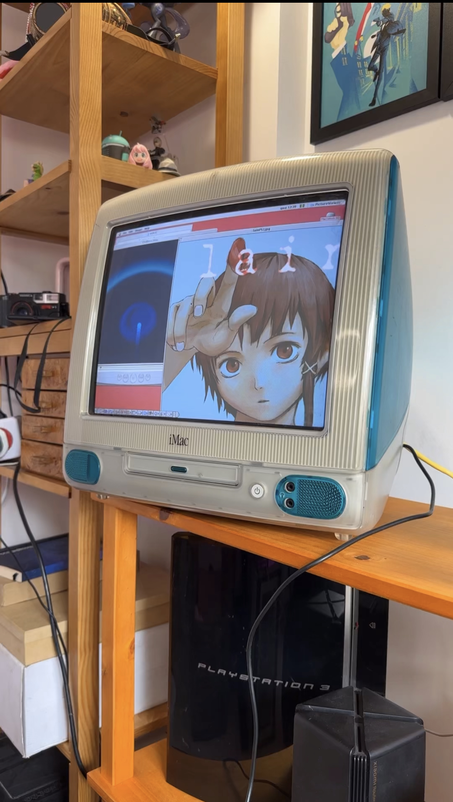
<!-- end_slide -->
# whoami
---

Anne / Anya / Anne

Head of gambiarra

Cat girl hacker

[https://github.com/retpolanne](https://github.com/retpolanne)

[https://blog.retpolanne.com](https://blog.retpolanne.com)
<!-- end_slide -->
# O que vem por aí
---

- Serial Experiments Anne - o incrível mundo do UART

- The PHYnal Countdown

- Miscelânea
<!-- end_slide -->
# Serial Experiments Anne - o incrível mundo do UART
---
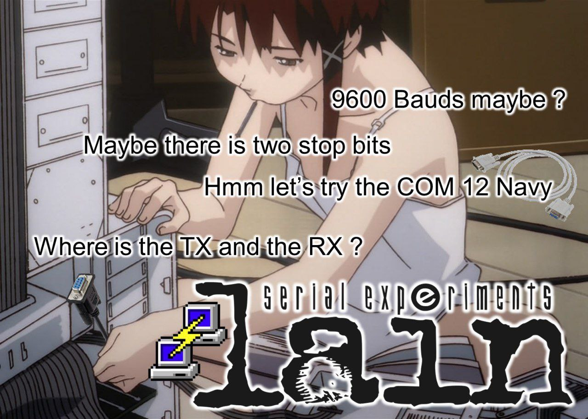
<!-- end_slide -->
# Baud Rate, UART, TTL e RS232
---
- baud /bɔːd/ é a medida de pulsos por segundo ou sinais que um equipamento transmite
- quando conseguimos dar match entre o baud rate de dois dispositivos, eles podem conversar entre si!
- o mais comum é utilizarmos sinais TTL (0v == 0, 5v == 1), e existem dispositivos que interpretam esses sinais em série (como bits, e aí ASCII)
- UART é um circuito que faz transmissão (Tx) e recepção (Rx) de sinais 

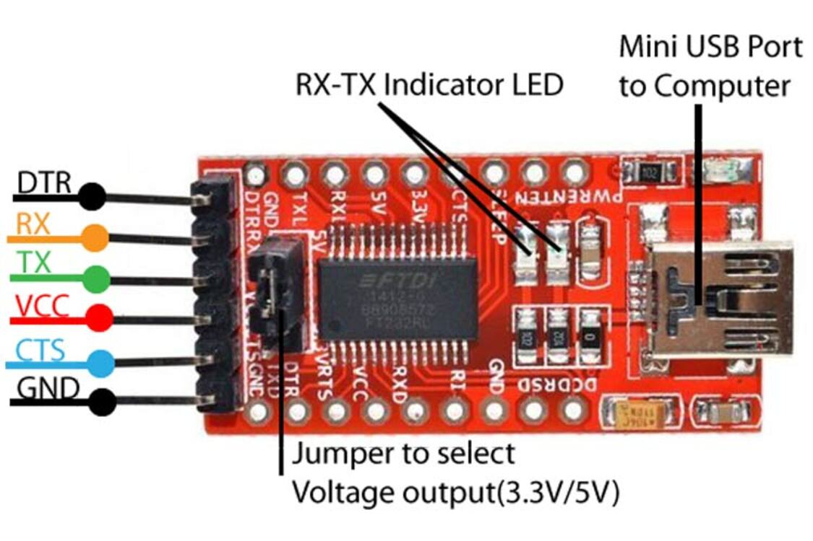

<!-- end_slide -->
# Curious Annie finds an opportunity to hack 🤔
---
- Eu costumo usar o Linux headless, via SSH
- Porém, não sei quando o sistema operacional está up ou se houve uma falha durante o boot
- Por que não ler o console serial do Linux via UART? 
<!-- end_slide -->

# Olhando pra placa mãe
---
Normalmente, placas com UART possuem três pinos: Rx, Tx e GND.

Porém, placas mãe possuem um header COM. 

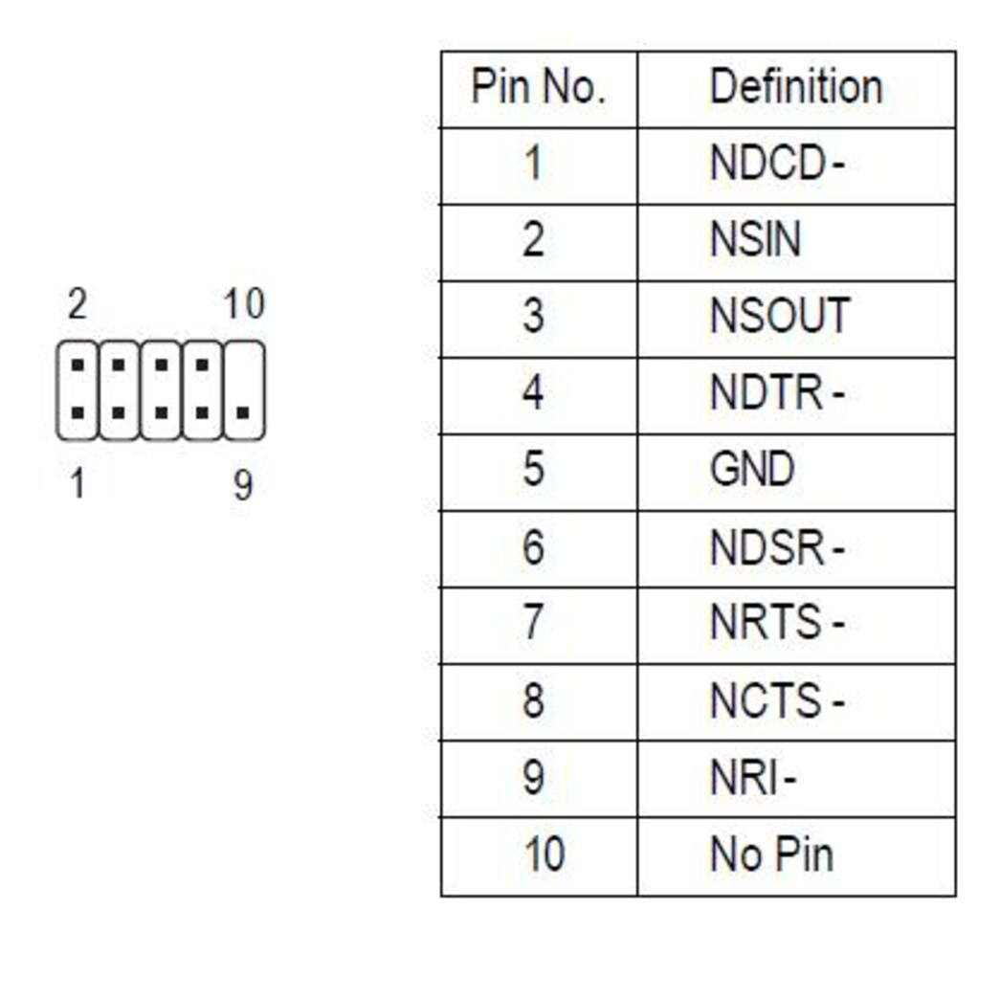

Aparentemente, NSIN == Rx, NSOUT == Tx, e temos um GND também.
<!-- end_slide -->

Porém, quando tentei ligar tudo num FTDI, garbage!

<!-- end_slide -->
# Annie ur breaking the board!!!!
---
Aparemente, placas mãe operam em RS232 (-12V, +12V), e não TTL (0v, 5v)! Eu poderia ter fritado tudo! 

Mas! Eu não sabia de um detalhe muito importante...

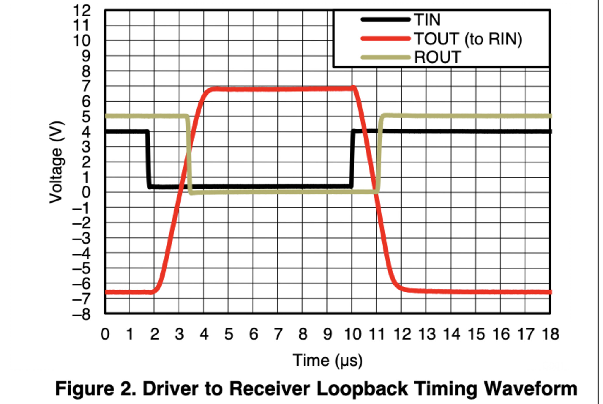
<!-- end_slide -->
Gambiarra um: tentativa de reduzir a voltagem 

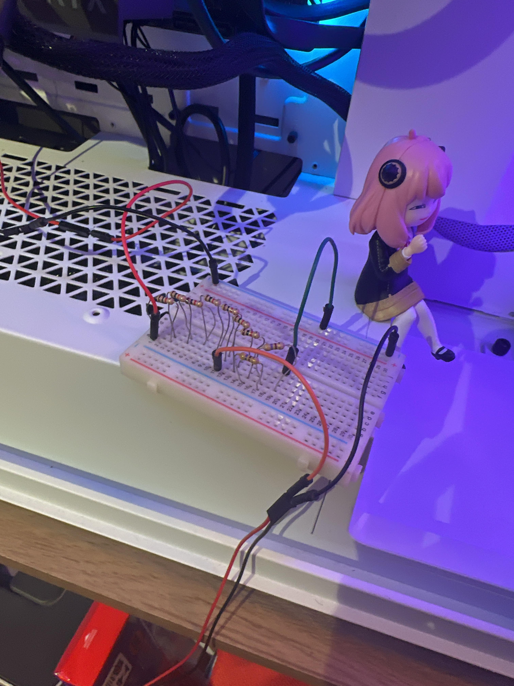

Não deu bom :c
<!-- end_slide -->

Depois de um dia inteiro rebootando o computador (e bloqueando meu TPM...), eu decidi usar um Logic Analyzer

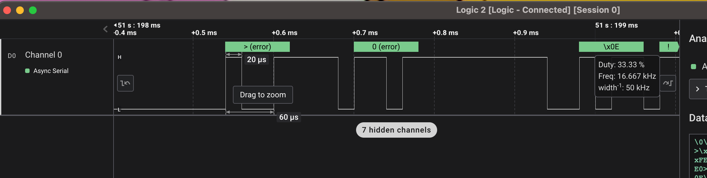

Nada fazia sentido :c
Até que corrigi o baud rate e inverti os bits:

DEU BOM! Os bits estavam invertidos.
<!-- end_slide -->

Conversando com um pessoal do grupo de Hardware Hacking, eu descobri que o sinal de RS232 é diferente do TTL! 

Eu precisava de algo para converter RS232 em TTL e vice-versa

Behold: MAX232!

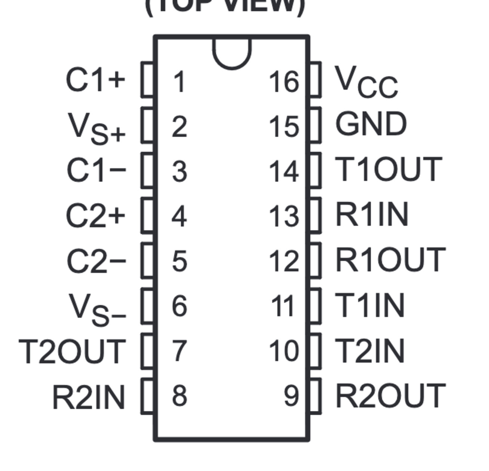
<!-- end_slide -->

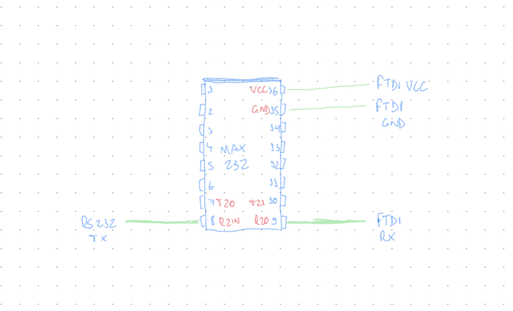
<!-- end_slide -->

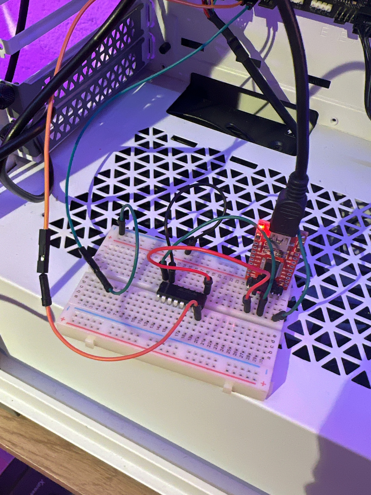
<!-- end_slide -->

<!-- end_slide -->
# The PHYnal Countdown
---
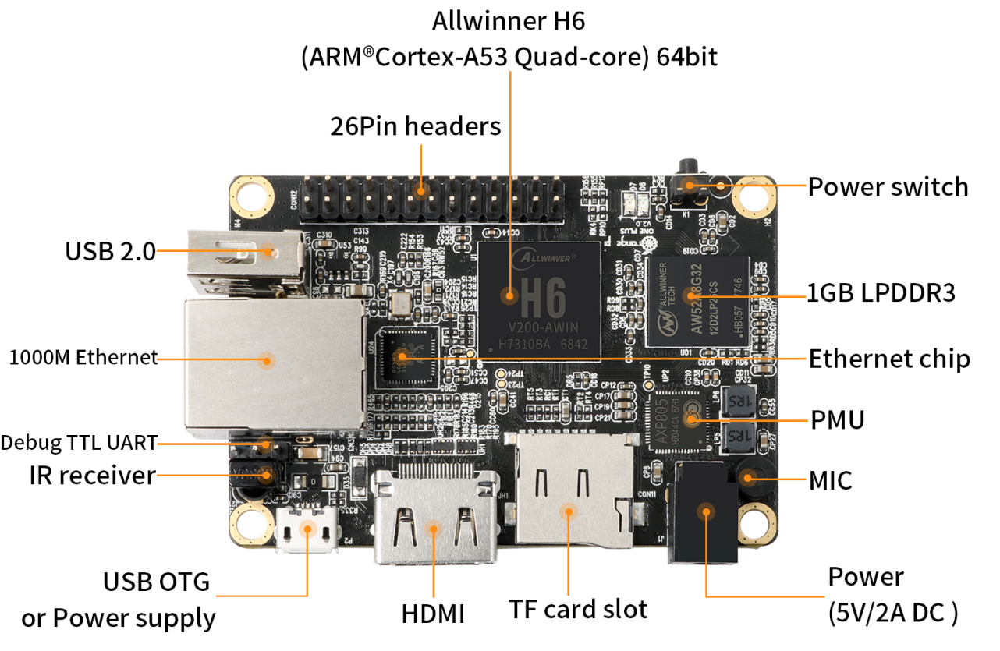
<!-- end_slide -->
# Orange Pi One Plus no fundo da gaveta
---
O que fazer com ela? Buildar Linux usando Yocto, oras! 

Configura uns layers aqui e ali, roda o bitbake e voilá! Uma imagem prontinha pra ser flasheada pro SD card.
<!-- end_slide -->
# Tudo funcionando, só que não
---
A placa de rede simplesmente não funcionava :c sequer acendia a luz. 

Depois de conferir a device tree source, eu percebi que o suporte upstream a DHCP na Orange Pi One Plus não existia.

Fui besta de corrigir isso no u-boot ao invés de corrigir no upstream kernel 🤡
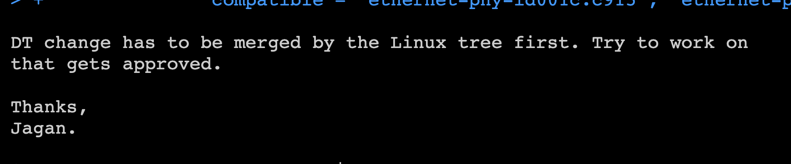

Tive que olhar alguns datasheets e testar várias coisas pra descobrir o problema: 

[Embedded systems from ground up: PHYnal Fantasy](https://blog.retpolanne.com/hardware/embedded/2023/07/07/embedded-phy.html)

Eu descobri uma ferramenta muito massa também pra rodar testes de pytest em dispositivos conversando via TTY! 

<!-- end_slide -->
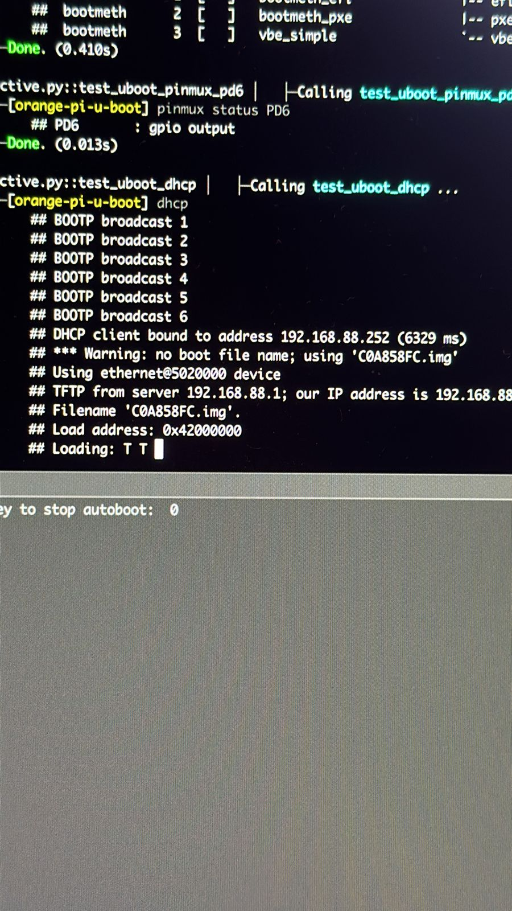
<!-- end_slide -->
# Miscelânea
---
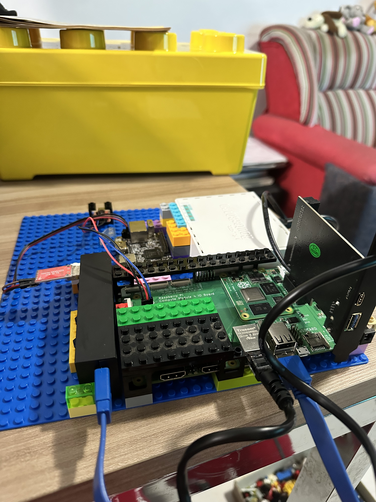
<!-- end_slide -->
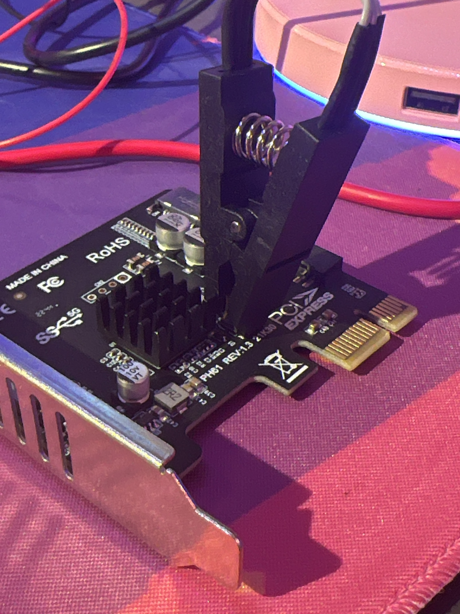

<!-- end_slide -->

<!-- end_slide -->
# Thank you

[https://github.com/retpolanne](https://github.com/retpolanne)

[https://blog.retpolanne.com](https://blog.retpolanne.com)

**Me pergunte sobre meu username**

<!-- end_slide -->
# Presented in glorious Presenterm
Direto do terminal, escrito em Rust.
## Presenterm by Matias Fontanini

[https://github.com/mfontanini/presenterm](https://github.com/mfontanini/presenterm)
<!-- end_slide -->
